# Medical web application for medical workers and patients (Hospital Management System)

Goal of the project is to develop a **Medical CRM** which will solve issues and
flaws of the health system.

Web application is developed using **Python Django** as a back-end service,
and front-end part which was written in **Vue.js**.

Below you could see the ER-diagram of the database, which includes entities like Doctor, Patient, Department, Appointment,
Medical_Status, Prescription and so on.

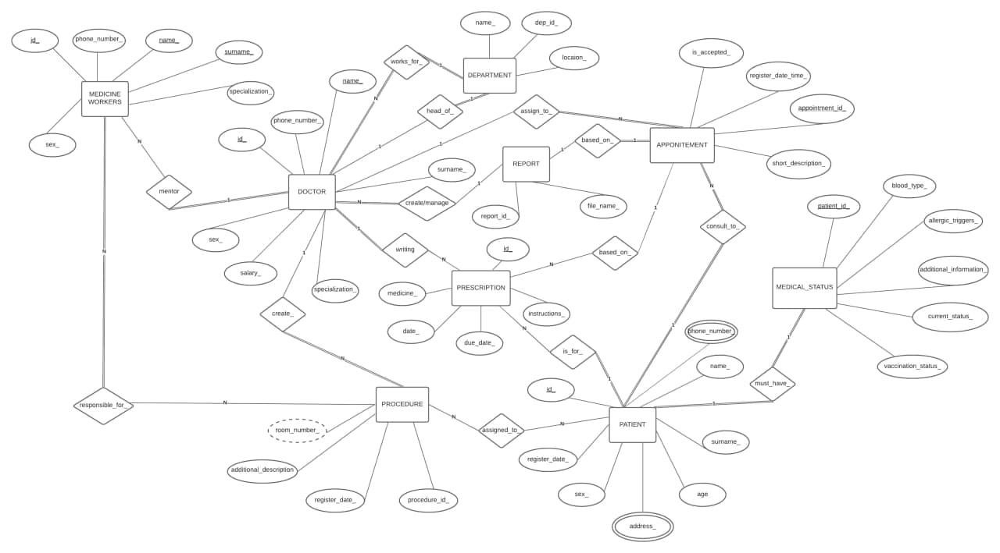

Figure 2. ER-diagram of the HMS system

The figure below represents simple Activity Diagram, depicting how the user logs in to the system and transferred to their profile.

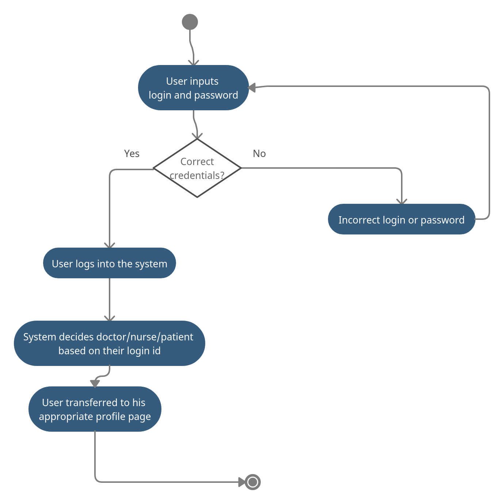

Figure 3. User Authentication Activity Diagram

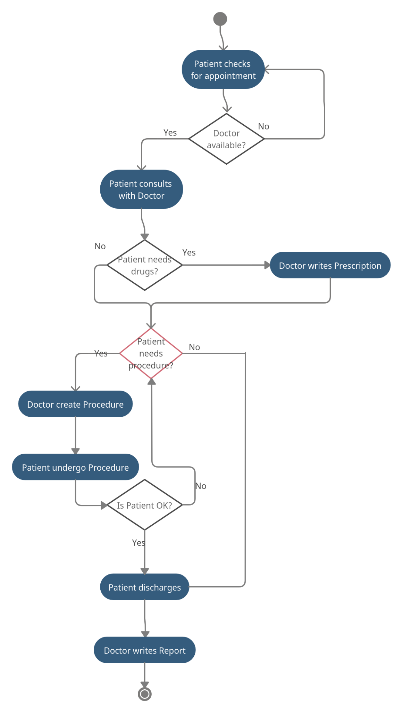

Figure 4. Appointment Module

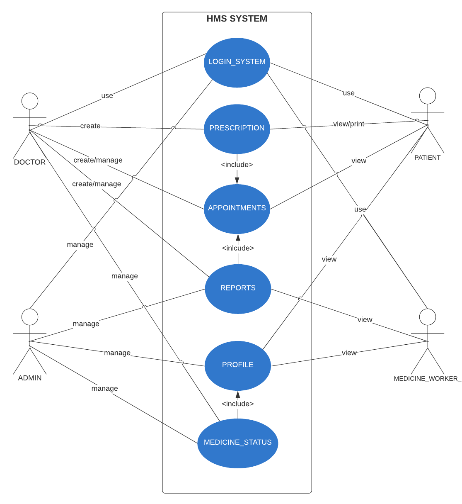

Figure 6. Interaction between various actors in the system

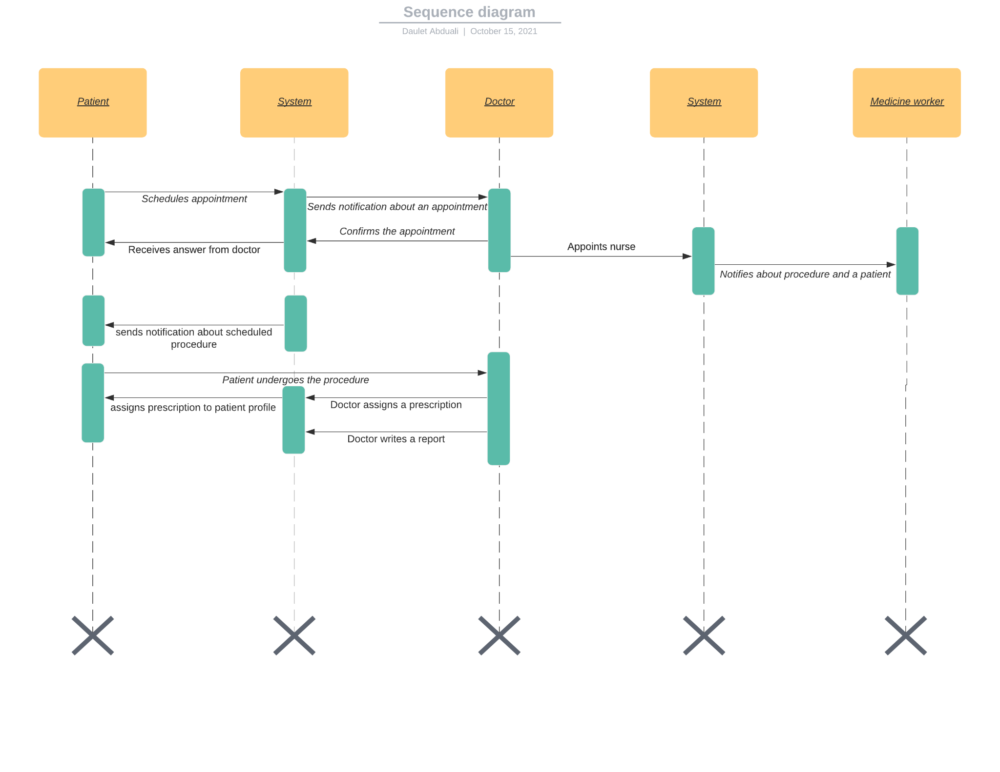

Figure 7. Sequence Diagram. Doctor-Patient-System Interaction

## Web Portal Interface

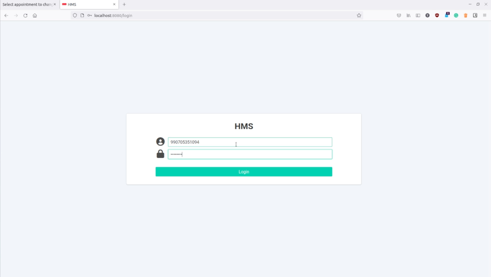

Figure 9. User Login Page

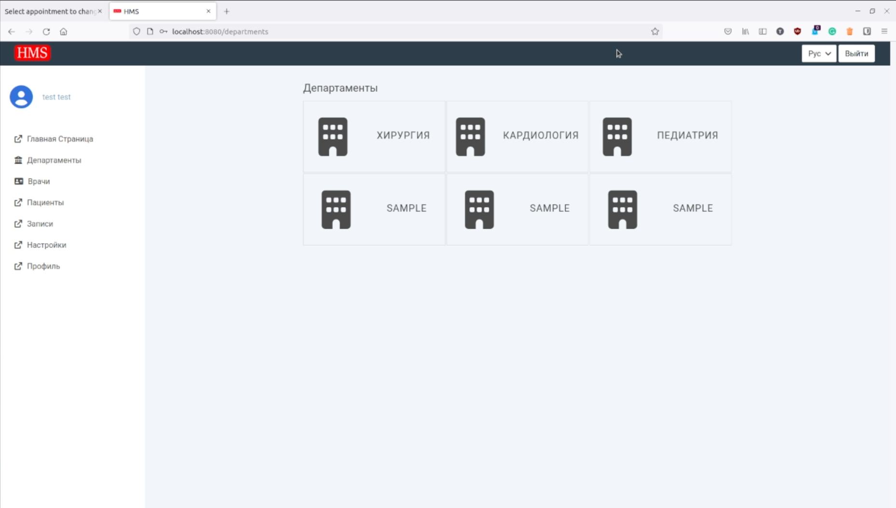

Figure 10. Departments Page

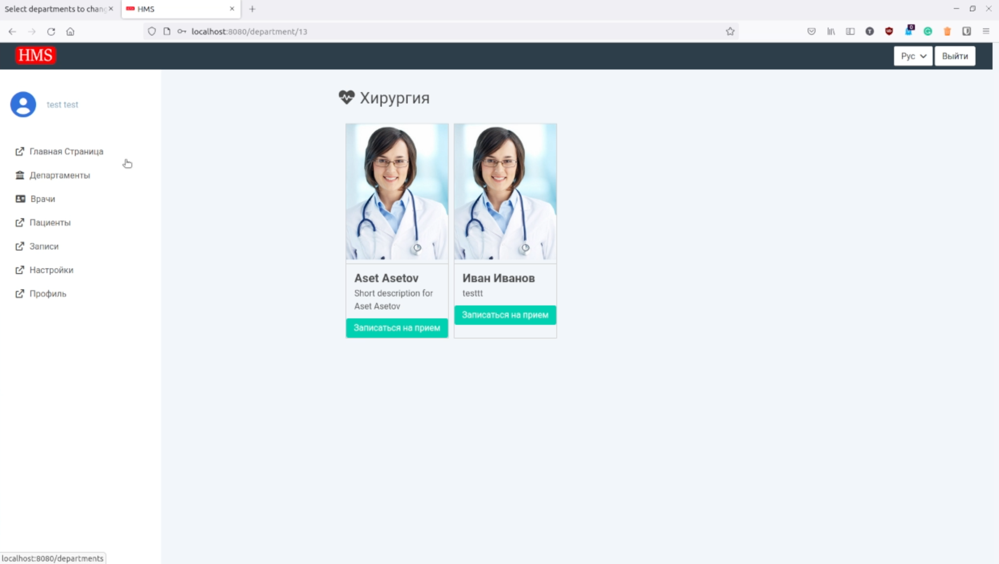

Figure 11. Picking a doctor from a certain department

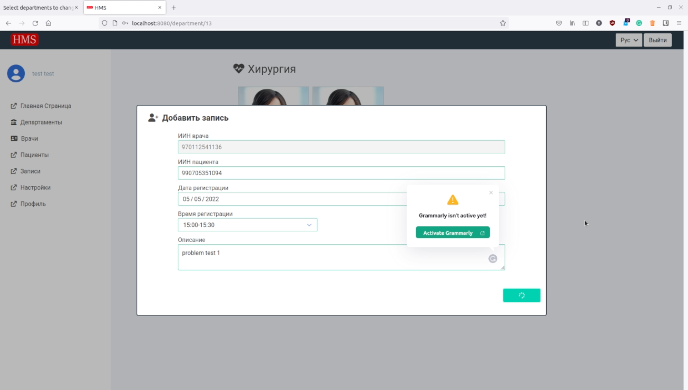

Figure 12. Appointment Form

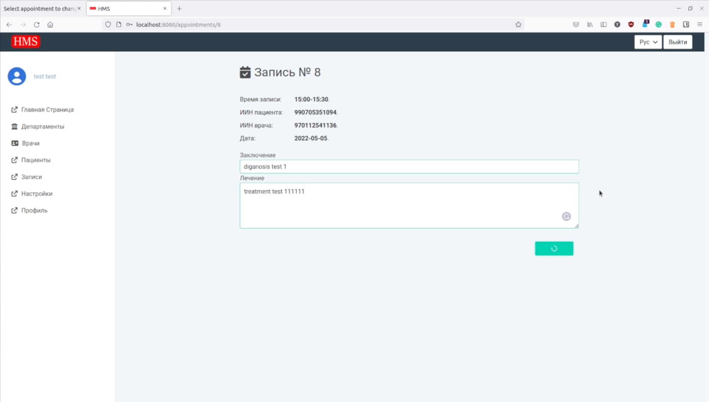

Figure 14. Doctor prescribes

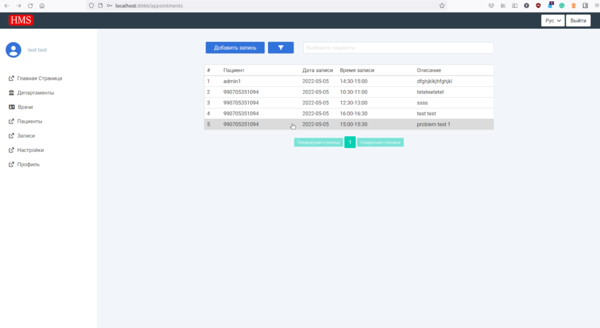

Figure 15. All appointments viewed by the admin

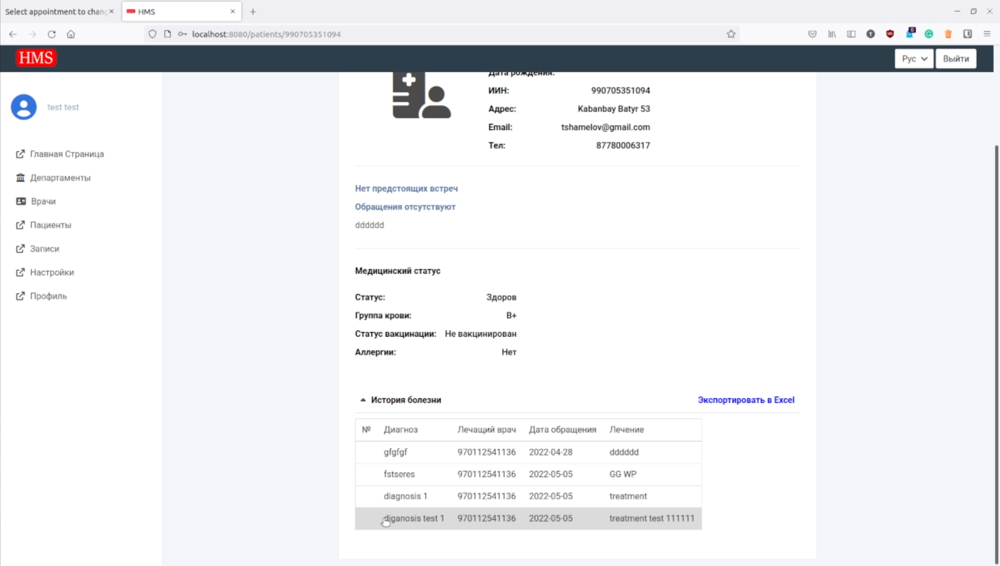

Figure 16. Patient Profile with Medical History

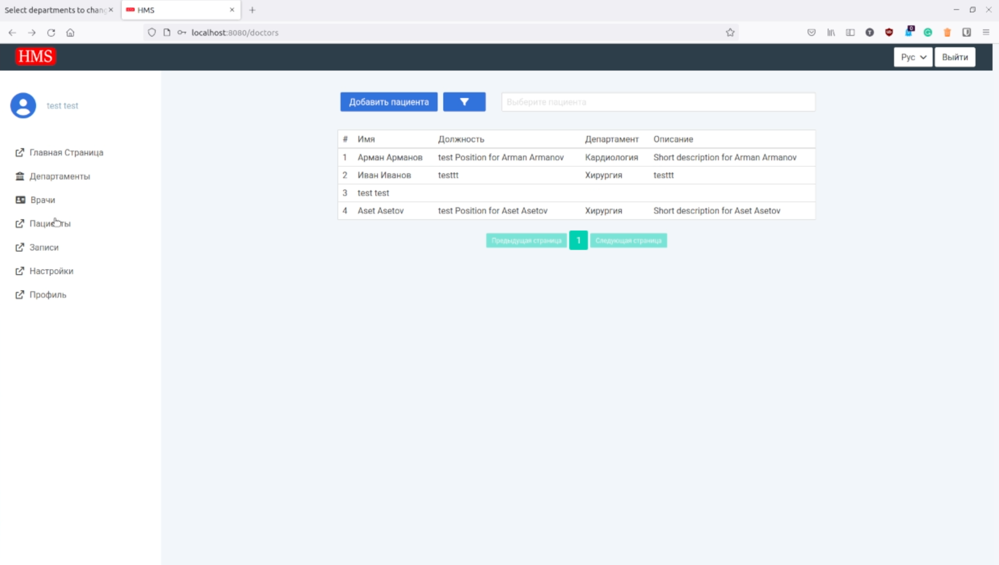

Figure 17. Doctors list

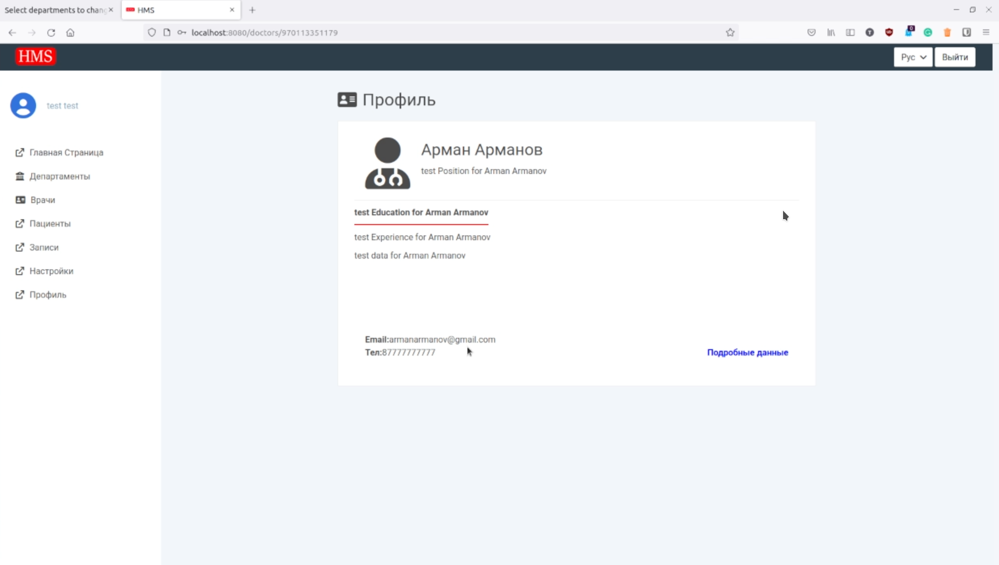

Figure 18. Doctor profile

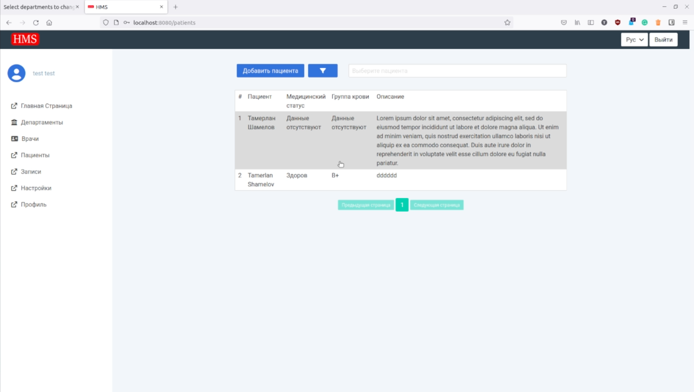

Figure 19. Patients list

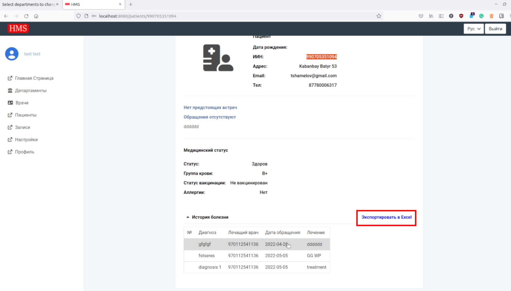

Figure 20. Patient Profile
